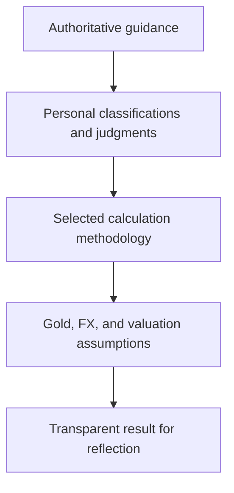

# Huqúqu'lláh Methodology Workbench

## Design and discourse plan — discussion draft v0.1

**Date:** July 18, 2026  
**Status:** Handoff-ready discussion draft; not institutional guidance  
**Working description:** A learning-oriented, multi-currency workspace that helps individuals and couples make their Huqúqu'lláh methodology explicit, maintain understandable records, explore alternative approaches, and share learning without presenting one person's implementation as the only legitimate method.

---

## 1. The project in one paragraph

The project begins with an existing Coda/Superhuman Docs prototype. A person can list accounts or other holdings, record their value and currency, and indicate whether each item is currently regarded as assessable for Huqúqu'lláh. A separate ledger records payments and the quantity of gold represented by each payment at the time it was made. The prototype then translates the previously assessed or "purified" base into today's currency value using the current price of gold and compares that reference point with current assessable wealth. The proposed next step is not merely a more polished calculator. It is a **methodology workbench**: a transparent tool and accompanying discourse framework in which source guidance, personal judgment, market assumptions, and mathematical operations remain visible and distinguishable.

## 2. Purpose

The project should help people:

1. Learn how the law of Huqúqu'lláh may be carried out in practice.
2. Describe their own approach in language that another person can understand.
3. See exactly where authoritative guidance ends and personal judgment or operational methodology begins.
4. Maintain records without having to reconstruct years of asset values, payments, exchange rates, and gold prices from memory.
5. Work across multiple currencies, including households whose holdings or payments span currencies.
6. Compare approaches without requiring consensus or implying that one user's tool settles questions of conscience.
7. Share learning while preserving privacy and avoiding pressure, solicitation, or an atmosphere of financial surveillance.

The ideal posture is:

> "This is how I am currently understanding and carrying out the law. Here are the sources, judgments, assumptions, and calculations involved. Here is what the result would look like under some other approaches. I offer it as an experiment and an invitation to learn together."

### Non-goals

The project is not intended to:

- Adjudicate which sincere methodology another person must use.
- Replace authoritative guidance or consultation with a Representative or Trustee of Huqúqu'lláh.
- Demand, solicit, transmit, or monitor payment.
- Turn a matter of conscience into a compliance system.
- Provide tax, legal, or investment advice.
- Require people to disclose personal wealth in order to participate in the discourse.

## 3. Source-grounded foundation

The tool should visibly distinguish foundational guidance from an implementation chosen by a user.

The official *Codification of the Law of Huqúqu'lláh* states, among other points, that:

- The initial threshold is assessable possessions equal to 19 mithqáls of gold, approximately 69.2 grams or 2.2 troy ounces.
- The rate is 19 percent, with payment calculated on whole units of 19 mithqáls.
- A needful residence and furnishings, and needful business or agricultural equipment used for subsistence, are exempt.
- General living expenses, taxes and duties, and certain losses or transaction expenses are among deductible expenses.
- Debts take precedence.
- Unrealized appreciation is not assessed until realized.
- The individual decides what is "necessary" or "needful" where detailed rulings do not prescribe the answer.
- A husband and wife may choose to honor their obligations jointly or individually.
- Time and method of payment are left to the discretion of the individual.

The wider guidance emphasizes that calculation and payment are matters of conscience between the individual and God and that Huqúqu'lláh may not be demanded or individually solicited.

These principles should shape both the math and the tone of the product. The interface should inform and reveal; it should not command, shame, rank, or pursue.

Primary references:

- [A Codification of the Law of Huqúqu'lláh — determining the amount](https://www.bahai.org/library/authoritative-texts/compilations/codification-law-huququllah/4)
- [The Kitáb-i-Aqdas — note on Huqúqu'lláh](https://www.bahai.org/library/authoritative-texts/bahaullah/kitab-i-aqdas/15)
- [Huqúqu'lláh—The Right of God — application of the law](https://www.bahai.org/library/authoritative-texts/compilations/huququllah-right-god/3)
- [Universal House of Justice, 26 November 2000](https://www.bahai.org/library/authoritative-texts/the-universal-house-of-justice/messages/20001126_001/1)

This project should not describe itself as an official calculator or substitute for consultation with a Representative or Trustee of Huqúqu'lláh.

## 4. The key conceptual separation

Every displayed result should be understood as the product of four layers:



### Layer 1: Authoritative guidance

Examples include the 19-mithqál unit, the 19 percent rate, stated exemptions, treatment of annual expenses, and freedom for spouses to proceed jointly or individually.

### Layer 2: Personal classifications and judgments

Examples include whether a particular holding is needful, whether an expense is necessary, how ownership is allocated between spouses, and how to treat an unusual asset when detailed guidance does not answer the case mechanically.

### Layer 3: Selected calculation methodology

Examples include a lifetime assessable-wealth ledger, an annual surplus orientation, a gold-indexed previously-assessed baseline, or a simplified personal practice based on income.

### Layer 4: Market and valuation assumptions

Examples include the gold-price source and timestamp, the foreign-exchange source, whether an asset is valued at market value or realized proceeds, and the rounding rule.

The tool must never silently collapse these layers. A person should be able to click any result and see which source rule, judgment, method, rate, and formula contributed to it.

## 5. Existing prototype: what should be preserved

The current Coda/Superhuman Docs prototype already contains the beginnings of the right model:

- A holdings table with one row per account, asset, or category of wealth.
- A user-controlled decision about whether each row is currently included in assessable wealth.
- A ledger of Huqúqu'lláh payments.
- A historical gold conversion associated with each payment.
- A current, gold-indexed representation of wealth previously treated as purified or assessed.
- A comparison between current assessable holdings and that historical reference.

The next version should preserve the row-level visibility and ledger orientation. It should add clearer terminology, multiple currencies, explicit methodology profiles, an audit trail for judgments and prices, and a way to compare methods without corrupting the underlying facts.

## 6. A crucial terminology and formula distinction

"The amount of gold represented by a payment" and "the amount of wealth represented by that payment" are not the same quantity.

For a payment made at the 19 percent rate:

```text
payment_gold_grams
    = payment_amount / gold_price_per_gram_on_payment_date

assessed_base_gold_grams
    = payment_gold_grams / 0.19

current_gold_indexed_assessed_reference
    = assessed_base_gold_grams × current_gold_price_per_gram
```

The system should store or derive both values:

- **Payment gold-equivalent:** how much fine gold the Huqúqu'lláh payment itself represented on its payment date.
- **Assessed-base gold-equivalent:** how much underlying assessable wealth that payment represented if it was exactly 19 percent of the base.

This distinction should be confirmed against the behavior of the existing prototype. If the prototype already makes the division by 0.19, the new terminology merely makes it explicit. If it currently compares the payment gold-equivalent directly with total wealth, the formula needs reconsideration.

"Purified" may remain the human and spiritual term used in the narrative. In tables and formulas, **previously assessed base** or **gold-indexed assessed reference** will often be less ambiguous.

## 7. Methodology profiles

The system should retain one canonical set of raw holdings, cash flows, payments, and historical rates. Methodologies should be interchangeable calculation profiles operating on those facts. Switching methods must not rewrite the ledger.

### Profile A: Gold-indexed lifetime assessed-base method

This most closely describes the current experiment.

1. Determine current assessable wealth from included holdings.
2. Convert each qualifying historical payment into gold at its payment-date price.
3. Divide by 0.19 to derive the gold-equivalent assessed base represented by the payment.
4. Revalue that gold-equivalent base at the current gold price.
5. Compare current assessable wealth with the current gold-indexed assessed reference.
6. Apply the selected unit and rounding treatment to any positive difference.

This profile treats gold not only as the threshold unit but as a continuing reference for previously assessed wealth. That is a methodological choice and should be identified as such rather than silently presented as an explicit requirement of the law.

### Profile B: Unitized assessable-wealth ledger

This profile centers the 19-mithqál unit and the principle that a given property is assessed once.

1. Track assessable property and subsequent eligible increases.
2. Maintain an unassessed carry-forward below one complete unit.
3. When the eligible increase reaches another whole unit, calculate the payment for the completed unit or units.
4. Preserve loss and recovery history so recovering a prior loss is not mistaken for a new increase.
5. Treat realized and unrealized gains distinctly.

The precise treatment of partial units and any amount above a completed unit should be documented from the authoritative sources and verified before this profile is presented as a definitive implementation.

### Profile C: Annual surplus or income-accretion method

This profile begins with flows rather than a current balance sheet.

1. Record income or other inflows during a period.
2. Deduct the expenses the user regards as necessary.
3. Add the remaining accretion to any prior unassessed carry-forward.
4. Apply the 19-mithqál threshold and unit rules.
5. Reconcile the result periodically with assessable possessions.

This may feel more natural to people who budget annually and can be another operational view of increases in possessions.

### Profile D: Nineteen percent of selected income

Some individuals may choose a simple personal practice of giving 19 percent of selected income without waiting for a unit threshold or completing a full asset assessment.

The system may support recording or modeling this practice, but it should label it accurately: **a personal simplification or voluntary practice**, not a claim that the authoritative threshold does not exist. Payments may still be recorded in the shared ledger.

### Profile E: Manual or custom method

The user records their own calculated base, adjustments, and payment. The tool supplies rate history, documentation, and reconciliation without claiming to have derived the obligation.

This is important for unusual circumstances and for users who want recordkeeping without delegating judgment to software.

## 8. Proposed common language

| Term | Proposed meaning |
| --- | --- |
| **Assessable possession / wealth** | Property the user currently includes in the Huqúqu'lláh calculation under their understanding and chosen method. |
| **Exempt / needful** | Property excluded because it is understood to fall within a stated exemption. |
| **Necessary expense** | An expense the user judges deductible when determining an increase or surplus. |
| **Uncertain** | An item not yet classified; it should remain visible and should not be silently counted or excluded. |
| **Deferred** | An item whose assessment is intentionally postponed, such as value not yet realized under the selected method. |
| **Huq unit** | Nineteen mithqáls of gold, approximately 69.2 grams of fine gold. |
| **Unit value** | The value of 69.2 grams of gold in a selected currency at a specified time. |
| **Payment gold-equivalent** | Fine-gold weight represented by a payment at the historical payment-date price. |
| **Previously assessed base** | Wealth on which a prior payment was understood to have been made. |
| **Assessed-base gold-equivalent** | Gold weight representing the underlying base, normally the payment gold-equivalent divided by 0.19. |
| **Gold-indexed assessed reference** | Current currency value of the historical assessed-base gold-equivalent. Used only by methods that intentionally index the base to gold. |
| **Unassessed carry-forward** | Eligible value below a complete unit that is retained for a later assessment under a unitized method. |
| **Valuation date** | Date and time at which holdings, gold, and currencies are being compared. |
| **Indicated payment** | The amount produced under the selected method and assumptions; preferable in the interface to an unqualified "amount owed." |
| **Methodology statement** | A human-readable summary of the rules, judgments, and market assumptions selected by the user. |

The vocabulary itself should remain open to consultation and improvement. A major outcome of the project may be a clearer shared language even if users continue to calculate differently.

## 9. Data model

### Household or workspace

- Workspace name
- Reporting currency
- Assessment structure: joint, individual, or mixed views
- Participants
- Default gold-price source
- Default foreign-exchange source
- Time zone and valuation-time convention
- Current methodology profile
- Privacy and sharing settings

### Participant

- Name or private label
- Ownership share or role
- Individual reporting currency, if different
- Whether included in a joint assessment

### Holding or asset snapshot

- Asset label; account numbers should not be required
- Asset category
- Amount and original currency
- Quantity and unit, when not currency-denominated
- Valuation date
- Owner: one participant, joint, or percentage split
- Classification: included, exempt, deferred, uncertain
- Reason tag and free-text rationale
- Realized/unrealized status where relevant
- Source of value or manual override
- Effective dates and change history

### Income, expense, and adjustment

- Date or period
- Amount and original currency
- Category
- Participant or joint ownership
- Necessary/non-necessary/uncertain classification
- Relationship to a holding, loss, debt, gift, inheritance, or realized gain
- Notes and supporting source

### Debt or obligation

- Amount and currency
- Date
- Participant or joint ownership
- Treatment under the selected method
- Rationale and repayment status

### Huqúqu'lláh payment

- Payment date
- Amount and payment currency
- Payment type: calculated, voluntary, adjustment, legacy/imported, or unknown
- Gold price and unit on payment date
- FX rate if a cross-currency conversion was used
- Payment gold-equivalent in grams
- Assessed-base gold-equivalent in grams, when applicable
- User-entered assessed base override, if the payment was not exactly 19 percent
- Receipt or reference, optional
- Notes

### Rate snapshot

- Rate type: gold or FX
- Provider and source URL/identifier
- Timestamp and time zone
- Quoted pair and direction
- Spot/fix/manual status
- Market-open, market-closed, or estimated status
- Original precision
- Any subsequent correction

### Methodology profile and decision log

- Profile name and version
- Formula version
- Unit and partial-unit policy
- Treatment of gold indexing
- Rounding policy
- User decisions and overrides
- Date, rationale, and person making each decision

## 10. Multi-currency design

Gold should be the currency-neutral bridge, stored internally as grams of fine gold. Original financial values should never be overwritten by conversions.

The system should:

1. Preserve every holding and payment in its original currency.
2. Convert current holdings using FX rates from the chosen valuation date.
3. Convert historical payments using payment-date FX and gold prices, not today's rates.
4. Store the resulting fine-gold grams so the history is reproducible even if a data provider later changes.
5. Allow any reporting currency without changing the underlying gold or source-currency records.
6. Show a complete derivation: original amount → FX conversion, if any → gold grams → current reporting value.
7. Permit manual rates with a visible label when reliable historical rates are unavailable.
8. Use decimal arithmetic; never use binary floating-point for money, gold weights, or FX calculations.
9. Round only at clearly defined display or payment boundaries, not during intermediate conversions.

The user should choose a convention for weekends and holidays: last market close, a named daily fixing, or a manual quote. Futures prices should not be silently substituted for spot or fixed gold prices.

## 11. Couple and household support

Because spouses may proceed jointly or individually, the system should not force one household model.

It should support:

- Separate participant ledgers with a consolidated household view.
- A fully joint ledger.
- Mixed ownership with explicit percentage allocation.
- Joint holdings that are classified differently under individual methods.
- Payments made from a joint account but attributed to one or both assessment bases.
- A methodology statement explaining the choice.

Changing from a joint to an individual view should recalculate the presentation without erasing historical ownership or payment attribution.

## 12. User experience

### A. Setup

1. Read a short statement of purpose and limits.
2. Choose individual, joint, or exploratory mode.
3. Choose reporting currency and rate conventions.
4. Select a methodology profile or "I am still exploring."
5. Review the profile in plain language before entering data.

### B. Holdings and judgments

The main table should preserve the strength of the existing prototype. Each row should show value, currency, ownership, current classification, rationale, and conversion. Classification should not be merely yes/no: included, exempt, deferred, and uncertain are all meaningful states.

### C. Assessment dashboard

Depending on the selected method, the dashboard may show:

- Current included assessable wealth
- Current Huq unit value
- Previously assessed base
- Gold-indexed assessed reference, if used
- Unassessed carry-forward
- Current eligible increase or difference
- Complete units reached
- Indicated payment under this method
- Uncertain items and their possible effect

Every summary number should have a "show calculation" path.

### D. Methodology explorer

A user should be able to compare two or more methods side by side using the same facts. The comparison should explain *why* results differ—for example, gold indexing, annual versus lifetime orientation, treatment of partial units, or inclusion of a particular asset.

### E. Methodology statement and export

Generate a concise, shareable statement that can omit all private amounts:

- The user's orientation
- How the threshold and partial units are treated
- Whether prior assessed wealth is indexed to gold
- How necessary expenses and uncertain items are handled
- Whether spouses calculate jointly or individually
- Gold and FX conventions
- Questions the user is still exploring

This may be the most useful artifact for discourse because people can compare approaches without exposing their wealth.

## 13. Tone, privacy, and spiritual safety

The product handles unusually sensitive spiritual and financial information.

Design requirements:

- Do not use delinquency language, red warnings, countdowns, or repeated prompts to pay.
- Do not compare users, publish totals, award badges, or gamify payment.
- Prefer "indicated under your selected method" to an unexplained "you owe."
- Keep unresolved classifications visible without shaming the user.
- Require no account numbers or login credentials.
- Offer redacted exports and fictional demonstration data.
- Prefer local-first or strongly encrypted storage for a public implementation.
- Do not transmit payment or contact another person or institution automatically.
- Make deletion and complete data export straightforward.
- Clearly label educational material, source guidance, personal interpretations, and software-generated results.

## 14. Video and discourse package

The video should present a learning journey rather than unveil a definitive calculator.

### Suggested 6–8 minute structure

1. **Why this exists:** the practical challenge of remembering what has been assessed and explaining one's methodology.
2. **Posture:** a matter of conscience; the aim is visibility and shared learning.
3. **Prototype tour:** holdings, classifications, payment ledger, historical gold, and today's reference value.
4. **Worked fictional example:** one or two holdings, one prior payment, and a change in gold price.
5. **Where judgment enters:** exemptions, necessary expenses, ownership, rates, and partial units.
6. **Alternative approaches:** wealth, annual surplus, simplified income practice, and manual calculation.
7. **Invitation:** ask viewers to describe their methodology and improve the language, not disclose personal amounts.

### Questions to invite discussion

- Do you organize your thinking primarily around income, annual surplus, current wealth, or lifetime assessed property?
- What persistent state do you keep: currency amounts, gold units, completed Huq units, or something else?
- How do you track partial units?
- How do you handle losses and later recovery?
- How do you distinguish realized from unrealized gains?
- What value date and gold-price convention do you use?
- How do multi-currency holdings affect your records?
- If calculating as a couple, what does joint or individual treatment mean operationally?
- Which decisions are matters of personal judgment in your approach?
- What language would make it easier to discuss methods without implying judgment of another person?

## 15. Implementation phases

### Phase 0: Clarify and validate

- Record a short walkthrough of the existing prototype.
- Confirm the existing "purified" formula, especially the distinction between payment gold-equivalent and assessed-base gold-equivalent.
- Create a source-to-rule matrix from authoritative guidance.
- Consult a knowledgeable Representative or Trustee about any implementation that may be described publicly as source-grounded.
- Choose provisional common terminology.

### Phase 1: Calculation specification

- Define each methodology as a pure function over shared raw data.
- Write formulas and rounding rules.
- Define how partial units, losses, recovery, debts, realized gains, gifts, inheritance, and voluntary payments behave.
- Build worked examples and expected results before coding.
- Decide gold and FX providers and offline/manual fallback behavior.

### Phase 2: Interactive prototype

- Import or recreate the current holdings and payment-ledger experience.
- Add multi-currency conversion and rate snapshots.
- Add individual/joint household views.
- Add calculation explanations and methodology comparison.
- Use fictional demonstration data for testing and video.

### Phase 3: Discourse and sharing layer

- Generate redacted methodology statements.
- Produce the walkthrough video.
- Invite structured feedback using the discussion questions.
- Track terminology and method revisions as versioned proposals.

### Phase 4: Public-quality release, if desired

- Complete privacy and security review.
- Add import/export, backups, and migration support.
- Add accessibility and localization.
- Document data sources and outages.
- Establish a process for correcting rates or formulas without rewriting historical records.

## 16. Test scenarios required before implementation is trusted

1. A single USD holding exactly equal to one current Huq unit.
2. A holding slightly below and slightly above a complete unit.
3. Several holdings in USD, EUR, and CAD consolidated into one reporting currency.
4. A payment made in a currency different from the household's reporting currency.
5. A historical payment made when gold was substantially cheaper than today.
6. A payment that was voluntary or not exactly 19 percent of a known base.
7. Joint property viewed jointly and then allocated between two spouses.
8. A holding marked uncertain, with results shown both including and excluding it.
9. An unrealized gain followed by a sale that realizes the gain.
10. A loss followed by recovery to the previously assessed level.
11. A debt that takes precedence over payment.
12. A partial unit carried across multiple years.
13. A weekend valuation using the last market close.
14. A missing historical FX or gold quote resolved by a labeled manual rate.
15. A corrected data-provider quote that does not silently alter a locked historical assessment.

## 17. Success criteria

The project succeeds if:

- Two people using different methods can explain precisely where their approaches diverge.
- A user can reproduce an old calculation from preserved inputs and rates.
- Multi-currency results do not depend on whichever display currency is selected.
- Method switching never damages the raw ledger.
- Every calculated number is explainable.
- Uncertainty and personal judgment remain visible.
- A person can share their methodology without sharing their wealth.
- The interface feels reflective and non-coercive.
- No screen or document implies that this private experiment is an official ruling or calculator.

## 18. Open decisions

The following decisions should be resolved—or intentionally left configurable—before implementation:

1. Does the existing prototype convert payment gold into the underlying assessed base by dividing by 0.19?
2. Is the gold-indexed assessed-base comparison the primary public method, one example among peers, or only a description of the creator's current experiment?
3. How should partial 19-mithqál units be carried and displayed?
4. Should the first public version store private financial data, or should it begin as a fictional-data methodology explorer and downloadable template?
5. Which gold benchmark and FX providers are appropriate, and what timestamp convention should apply?
6. Should method comparison calculate alternative dollar amounts or initially compare only concepts and formulas?
7. How much of income and expense tracking belongs in the tool versus importing an annual surplus figure?
8. Should "purified wealth" remain the principal user-facing phrase, with more technical terms beneath it?
9. What review or consultation should occur before the tool or video is shared broadly?
10. What is the intended first audience: personal contacts, a study group, Representatives/Trustees, software collaborators, or the wider Bahá'í community?

## 19. Recommended next deliverable

Before building a new application, produce a **calculation specification and example workbook** containing:

- One normalized schema
- The five methodology profiles
- Exact formulas
- Ten to fifteen fictional test cases
- Expected outputs under each method
- A source/rule/judgment/method classification for every operation
- A short terminology survey for reviewers

This will expose conceptual disagreements while they are still inexpensive to change and will give a coding agent an unambiguous contract.

## 20. Handoff prompt for a future implementation chat

> Use the attached *Huqúqu'lláh Methodology Workbench — Design and Discourse Plan* as the governing product brief. First produce a normalized data schema, a calculation specification for each methodology profile, and a suite of fictional test cases. Preserve a strict distinction between authoritative source guidance, personal classification choices, methodology choices, and market-rate assumptions. Treat raw holdings and payment records as canonical facts and methodologies as versioned, interchangeable calculations over those facts. Do not present the software as an official calculator, do not collapse all approaches into one, and do not begin production implementation until the open questions affecting formulas—especially payment gold-equivalent versus assessed-base gold-equivalent and partial-unit behavior—have been explicitly resolved.
